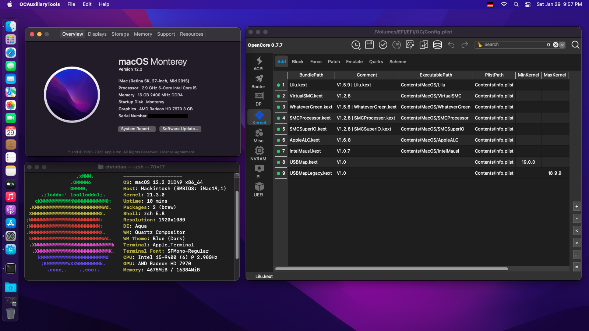

# Hackintosh on Gigabyte B360 M Aorus Pro



## Installed Monterey

- Followed the [Dortania's OpenCore Install Guide](https://dortania.github.io/OpenCore-Install-Guide/) (Guide updated to 0.7.5 at the time and referenced the OpenCore `Configuration.pdf` for version 0.7.7).
- Relevant options chosen based on the applicable hardware are mostly noted below.

### Specs

* CPU: Intel Core i5-9400 CPU @ 2.90GHz 6-Core (Coffee Lake)
* MB: Gigabyte B360 M Aorus Pro
* RAM: 16GB HyperX Fury 3200MHz DDR4
* SSD: Kingston 480GB A400 SATA 2.5"
* GPU: Sapphire Radeon Toxic R9 280X with dual 1080p monitors
* Ethernet: Intel I219-V
* WIFI: Fenvi FV-T919 (Broadcom BCM94360CD)
* Audio: Realtek ALC892
* OS: Monterey 12.1 updated to 12.2
* OpenCore 0.7.7

### Working

- Audio, Video, Ethernet, NVRAM, Wifi, Bluetooth
- Messages, iCloud
- All USB2 & USB3 ports
- Sleep
- Upgrading to Monterey 12.2 worked smoothly

## BIOS settings

### Disable

- [x] Fast Boot
- [x] Secure Boot
- [x] Serial/COM Port
- [x] VT-d (can be enabled if you set DisableIoMapper to YES)
- [x] CSM
- [ ] CFG Lock (not available in BIOS, must enable `AppleXcpmCfgLock`)

### Enable

- [x] Above 4G decoding
- [x] EHCI/XHCI Hand-off
- [x] OS type: Windows 8.1/10 UEFI Mode
- [ ] DVMT Pre-Allocated(iGPU Memory): 64MB
- [x] SATA Mode: AHCI

## Create EFI using OpenCore Auxiliary Tools

Used [GitHub: OpenCore Auxiliary Tools (OCAT)](https://github.com/ic005k/QtOpenCoreConfig) to create initial config, while cross checking each setting with *Dortania's OpenCore Install Guide* 

- Steps to take: [Generate EFI Folders using OpenCore Auxiliary Tools](https://github.com/5T33Z0/OC-Little-Translated/tree/main/F_Desktop_EFIs#generate-efi-folders-using-opencore-auxiliary-tools)
- Initialize EFI with Database > `Desktop_8th-9thGen_Coffee_Lake_iMac19,1.plist`

## Edit config.plist

### NVRAM

- `boot-args -v debug=0x100 debug=0x100 alcid=1` for debugging and audio

### Device Properties

- `AAPL,ig-platform-id 0300913E` the iGPU is only used for compute tasks and doesn't drive a display

### Kernel - Quirks

- `AppleXcpmCfgLock Yes`

### Misc - Security

Hide EFI and external in boot menu

- `ScanPolicy 983299`

### Platform Info

[Desktop Coffee Lake](https://dortania.github.io/OpenCore-Install-Guide/config.plist/coffee-lake.html#platforminfo)

- Using iMac19,1 for Mojave and newer
- For setting up the SMBIOS info, I used the built-in SMBIOS generator in OCAT, (instead of using the *GenSMBIOS* application).
- Click *Generate* once (near the SystemProductName field)

### UEFI - APFS

For multi-booting with Mojave

- `MinDate -1`
- `MinVersion -1`

## Create USB Installer & install

- Download latest Monterey (requires python):

```
mkdir -p ~/macOS-installer && cd ~/macOS-installer && curl https://raw.githubusercontent.com/munki/macadmin-scripts/main/installinstallmacos.py > installinstallmacos.py && sudo python installinstallmacos.py
```

- Use [GitHub - TINU: The open tool to create bootable macOS installers.](https://github.com/ITzTravelInTime/TINU) as a GUI for the `createinstallmedia` command

## Post-install

### Map USB Ports using USBMap

Python script for mapping USB ports in macOS and creating a custom injector kext.

[GitHub - corpnewt/USBMap: Python script for mapping USB ports in macOS and creating a custom injector kext.](https://github.com/corpnewt/USBMap)

- Working USB Config:

```
######################################################
# Discover USB Ports
######################################################
----- XHC@14 Controller -----

1. HS03 | AppleUSB20XHCIPort |  3 (03000000) | 14100000 | Type 0
   GigaFrontRight_asUSB2
2. HS04 | AppleUSB20XHCIPort |  4 (04000000) | 14200000 | Type 0
   GigaFrontLeft_asUSB2
3. HS05 | AppleUSB20XHCIPort |  5 (05000000) | 14300000 | Type 0
   RightLowUSB3_asUSB2
4. HS06 | AppleUSB20XHCIPort |  6 (06000000) | 14400000 | Type 0
   RightUpUSB3_asUSB2
5. HS07 | AppleUSB20XHCIPort |  7 (07000000) | 14500000 | Type 0
   UpLeftUSB2
6. HS08 | AppleUSB20XHCIPort |  8 (08000000) | 14600000 | Type 0
   LowLeftUSB2
   - USB Receiver
7. HS09 | AppleUSB20XHCIPort |  9 (09000000) | 14700000 | Type 0
   FrontRight_USB2
8. HS10 | AppleUSB20XHCIPort | 10 (0a000000) | 14800000 | Type 0
   FrontLeft_USB2
   - USB Combo Keyboard
9. HS14 | AppleUSB20XHCIPort | 14 (0e000000) | 14900000 | Type 255
   InternalBT_USB2
   - BRCM20702 Hub
     - AppleUSB20InternalHub
       - Bluetooth USB Host Controller
         - BroadcomBluetoothHostControllerUSBTransport
10. SS01 | AppleUSB30XHCIPort | 17 (11000000) | 14a00000 | Type 3
   UpMiddleUSB3.1
11. SS02 | AppleUSB30XHCIPort | 18 (12000000) | 14b00000 | Type 9
   LowMiddleUSB-C
12. SS03 | AppleUSB30XHCIPort | 19 (13000000) | 14c00000 | Type 3
   FrontRight_USB3
13. SS04 | AppleUSB30XHCIPort | 20 (14000000) | 14d00000 | Type 3
   FrontLeft_USB3
14. SS05 | AppleUSB30XHCIPort | 21 (15000000) | 14e00000 | Type 3
   LowRightUSB3
15. SS06 | AppleUSB30XHCIPort | 22 (16000000) | 14f00000 | Type 3
   UpRightUSB3
```

- Added `USBMap.kext`

### Debugging

- Initially configured with all recommended debugging settings enabled, which were lowered after all is working.

### Multi-Boot

- This configuration also successfully boots my Mojave 10.14.6 installation using the previously used serial for AppleID consistency.
