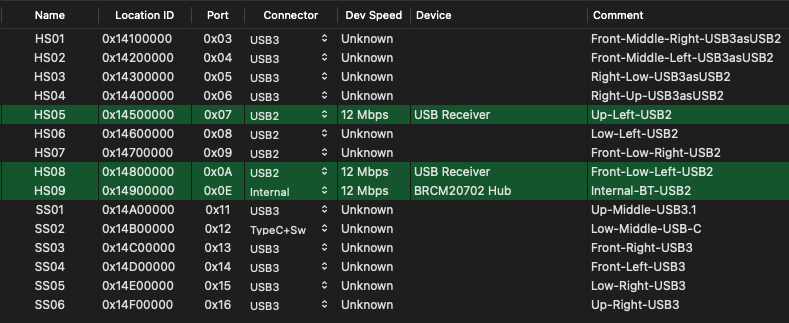

# Hackintosh on Gigabyte B360 M Aorus Pro

## Installed Monterey, updated to Ventura, then Sequoia

- Installed as described in the [OpenCore Visual Beginners Guide](https://chriswayg.gitbook.io/opencore-visual-beginners-guide/step-by-step/readme) based on [Dortania's OpenCore Install Guide](https://dortania.github.io/OpenCore-Install-Guide/) 
- Relevant options chosen based on the applicable hardware are mostly noted below.

### Specs

* CPU: Intel Core i5-9400 CPU @ 2.90GHz 6-Core (Coffee Lake)
* MB: Gigabyte B360 M Aorus Pro
* RAM: 16GB HyperX Fury 3200MHz DDR4
* SSD: Kingston 480GB A400 SATA 2.5"
* Boot NVMe: WD Blue SN570 500GB
* Data SSD: Kingston 480GB A400 SATA 2.5"
* GPU: Sapphire Radeon Toxic R9 280X with dual 1080p monitors
* Ethernet: Intel I219-V
* WIFI: Fenvi FV-T919 (Broadcom BCM94360CD)
* Audio: Realtek ALC892
* OS: initially Monterey 12.1 upgraded to 12.5
* OpenCore 0.8.2

### Working

- Audio, Video, Ethernet, NVRAM, Wifi, Bluetooth
- Messages, iCloud
- All USB2 & USB3 ports
- Sleep
- more details see Checklist

## BIOS settings

*Hackintosh relevant settings in italics.*

**Reset the BIOS to default values**

- Save & Exit -> Load Optimized Defaults

(take out BIOS battery or reset jumper, if unable to boot into BIOS)

**Minimum**

Absolute Minimum to boot into macOS Monterey 

- Peripherals -> USB Configuration -> *XHCI Hand-off: Enabled*

**XMP**

XMP Memory Settings
Kingston HyperX Fury 2 x 8GB, 3200MHz, HX432C16FB3AK2/16

- M.I.T -> Advanced Memory Settings -> XMP: Profile2 (uses DDR4-2667 CL15-17-17 @1.35V)

**BIOS**

- Full Screen LOGO Show: Disabled
- *Fast Boot: Disabled* (default)
- *Windows 8/10 Features: Other OS*
- *CSM Support: Enabled* (default)
  - will fail to boot into BIOS, if set to Disabled (5 beeps)
  - probably due to an issue with my GPU vBIOS

**Peripherials**

- Initial Display Output: PCIe 1 Slot (default)
- *Super IO Configuration -> Serial Port: Disabled*
- SATA And RST Configuration -> *SATA Mode Selection: AHCI* (default)
- *Software Guard Extensions (SGX): Disabled*

**Chipset**

- *VT-d: Enabled* (default) 
  - Set `DisableIoMapper` to YES in Config.plist
- *Internal Graphics: Enabled*
- *DVMT Pre-Allocated: 64M* (default)
- *Above 4G Decoding: Disabled* (default)
  - optionally add `npci=0x2000` to `boot-args` (macOS actually boots without it)
  - If Enabled, it starts with a very slow boot process and eventually fails to boot (possibly due to an issue with my GPU vBIOS)
- Wake on LAN Enable: Disabled

## Create EFI using OpenCore Auxiliary Tools

Used [GitHub: OpenCore Auxiliary Tools (OCAT)](https://github.com/ic005k/QtOpenCoreConfig) to create initial config, while cross checking each setting with *Dortania's OpenCore Install Guide* 

- Steps to take: [Generate EFI Folders using OpenCore Auxiliary Tools](https://github.com/5T33Z0/OC-Little-Translated/tree/main/F_Desktop_EFIs#generate-efi-folders-using-opencore-auxiliary-tools)
- Initialize EFI with Database > `Desktop_8th-9thGen_Coffee_Lake_iMac19,1.plist`

## Edit config.plist

### NVRAM

- `boot-args alcid=1` for audio

### Device Properties

- `AAPL,ig-platform-id 0300913E` the iGPU is only used for compute tasks and doesn't drive a display

### Kernel - Quirks

- `AppleXcpmCfgLock Yes`

### Misc - Security

Hide EFI and external in boot menu

- `ScanPolicy 983299`

### Platform Info

[Desktop Coffee Lake](https://dortania.github.io/OpenCore-Install-Guide/config.plist/coffee-lake.html#platforminfo)

- Using iMac19,1 for Mojave and newer
- For setting up the SMBIOS info, I used the built-in SMBIOS generator in OCAT, (instead of using the *GenSMBIOS* application).
- Click *Generate* once (near the SystemProductName field)

## Create USB Installer & install

- Download latest macOS

## Post-install

### Map USB Ports using USBToolBox

- Working USB Config as shown in Hackintool

### Debugging

- Initially configured with all recommended debugging settings enabled, which were lowered after all is working.

## Upgraded to Ventura 
**(then upgraded to Sequoia which follows the same steps)**

- Upgraded to latest OpenCore (1.0.+) and upgraded kexts
- Downloaded Ventura via OCLP and followed the normal macOS upgrade

At first I thought that my upgrade to Ventura had gone smoothly, until I noticed the window closing animation being very sluggish. Checking with Hackintool, I saw Quartz Extreme (QE/CI) inactive and Metal unsupported. After finding out that Ventura had dropped support for AMD's GCN 1-3 (7000 - R9 series) GPUs, I investigated the process for making my R9 280X work using OCLP.

Modifying the system with OCLP Requires SIP, Apple Secure Boot and AMFI to be disabled so there are some compromises in terms of security.

### Prepare the System

Initially the following changes are required in the `config.plist` :

* In the *NVRAM* section `boot-args` add temporarily:
   * `amfi_get_out_of_my_way=0x1`
* Also SIP needs to be disabled with a `csr-active-config`setting of
   * `03080000`

* Additionally in *Misc - Security* set `SecureBootModel` to
   * `Disabled`
* *Notes*:
   * `amfi_get_out_of_my_way=0x1`disables Apple Mobile File Integrity validation. Required for applying Root Patches with OCLP. It is ONLY needed for re-applying root patches with OCLP after System Updates.

Reboot the system.

### Patch with OCLP

Launch [OCLP](https://dortania.github.io/OpenCore-Legacy-Patcher/) and click on *Post-Install-Root-Patch*

* if you have one of the applicable graphics cards, it will show it as an available patch for your system.
* Start the patching
* Reboot to check that everything is working. [Hackintool](https://github.com/benbaker76/Hackintool/releases) should show Quartz Extreme (QE/CI) as active.
* For me disabling AMFI strangely caused Firefox to hang upon launch. Disabling AMFI is not needed any more for booting, therefore follow the next steps.

### Add AMFIPass.kext

Check https://github.com/dortania/OpenCore-Legacy-Patcher/tree/main/payloads/Kexts/Acidanthera and download AMFIPass.kext (use latest!) and add it to your OpenCore EFI as well as your config.plist

With the AMFIPass kext loaded `amfi_get_out_of_my_way=0x1` is no longer required for booting.

Therefore make the following changes in your `config.plist` :

* In the *NVRAM* section `boot-args` revert to your previous settings by removing:
   * `amfi_get_out_of_my_way=0x1

### Future System Updates

So far everything is working for me as expected. Additional settings might be required as well, based on 5T33Z0. 

- `amfi_get_out_of_my_way=0x1` to disable AMFI validation will be needed again for re-applying root patches with OCLP after System Updates.
- `AMFIPass.kext` needs to be updated when upgrading to Sequoia and also when upgrading OpenCore. It needs to be in synch with the other updated kexts, otherwise the GPU driver may not load successfully!

***References/Sources for OCLP on Hackintosh:***  
*-* [*OCLP Documentation*](https://dortania.github.io/OpenCore-Legacy-Patcher/)  
*- Helpful notes by* [*5T33Z0*](https://github.com/5T33Z0/OC-Little-Translated/blob/main/14_OCLP_Wintel/README.md) *about using OCLP*
