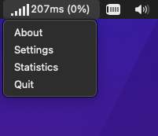

### Archive of Autoping

Autoping is a free menu bar indicator that shows you the current quality of your internet connection at a glance. It places a small indicator in the menu bar showing the current strength, presence, and functionality of the Internet connection. Click on the indicator to view more detailed descriptions of the network name, type of connection, mobile or stationary settings, etc.

**autoping 1.02** for Mac is a product of Memset Ltd released 2015-01-22. Compatible with Mac OS X 10.7 or later. Tested up to Monterey.It used to be available on the Apple App Store.

